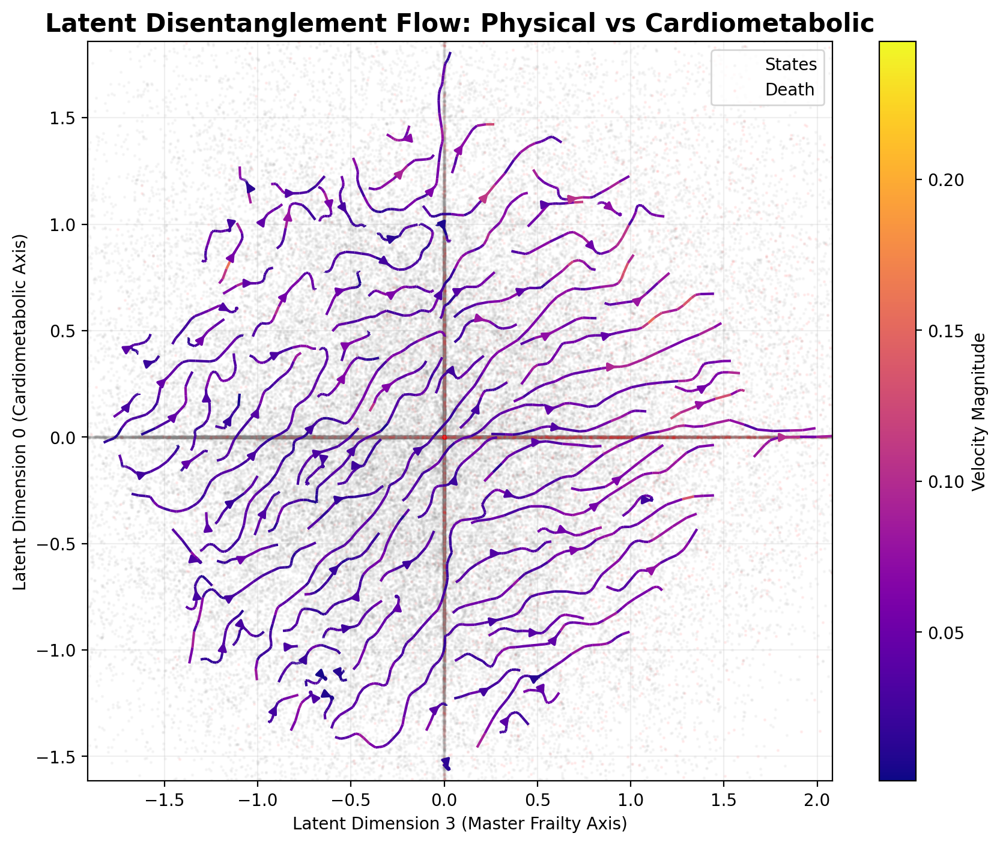

# 🌋 LAVA: Latent Aging Velocity Atlas
## Continuous-Time Mapping of Multi-Domain Biological Decline

LAVA is a production-grade diagnostic framework designed to disentangle the complex, non-linear trajectories of human aging. By projecting multi-domain clinical deficits into a continuous latent manifold, LAVA moves beyond static "snapshots" of health to measure the instantaneous velocity of biological aging.

## 🧠 Core Concept

Current clinical models track aging through discrete, irregular snapshots (like the Frailty Index). They can tell you how frail a patient is *today*, but they struggle to measure *how fast* that patient is declining.

LAVA was built on the premise that aging is not a state; it is a velocity. To predict mortality and biological collapse, we must calculate the mathematical derivative of a patient's health over time.

Here is how the LAVA engine achieves this:

1. **State Compression** — We take 36 noisy, multi-domain clinical survey answers and compress them into a precise 8-dimensional mathematical coordinate representing the patient's exact biological state (β-VAE).

2. **Continuous Interpolation** — Because patients visit the clinic at highly irregular intervals (e.g., gaps of 2, then 9 years), we fit a Gaussian Process to draw a smooth, continuous curve through their latent coordinates, filling in the missing years.

3. **Latent Velocity** — Leveraging the infinite differentiability of the Gaussian Process, we extract the exact analytical derivative ($\frac{dz}{dt}$) of the patient's trajectory. This gives us their instantaneous "aging velocity" at any given moment.

4. **Vector Field Prognostics** — By mapping 2.37 million of these historical velocity vectors, LAVA creates a continuous dynamics map of human aging. When a new patient arrives for a single visit, we instantly place them in this vector field to see which current they are caught in, predicting their future decline.
## Visual Highlights

### 1. The Currents of Aging (Latent Streamplots)
LAVA translates discrete health changes into a continuous vector field. Below is a streamplot representing the **disentangled flow of Physical vs. Cognitive decline**. Each "stream" shows the most likely trajectory for a patient at that specific biological coordinate.



### 2. Clinical Smoothness (Gaussian Process Interpolation)
LAVA resolves the "irregular snapshot" problem by fitting independent GPs to each patient's latent history. This allows us to calculate health derivatives even when years pass between clinic visits.


### 3. Automated Intervention Ranking
The Digital Twin engine simulates counterfactual scenarios, ranking lifestyle changes by their ability to reduce the 5-year velocity magnitude.


---

## 📈 Performance & Biological Validation

LAVA is not just a visualization tool; it is a high-precision prognostic engine validated against ground-truth clinical outcomes.

### 1. Predictive Accuracy (Reconstruction $R^2$)
The $\beta$-VAE captures the underlying biological signal with high fidelity across clinical domains:
- **Physical Mobility/ADLs**: 77.8% Variance Explained
- **Cognitive Function**: 73.7% Variance Explained
- **Clinical Comorbidities**: 61.7% Variance Explained
- **Overall Manifold Recovery**: 0.98 Mean Correlation

### 2. Mortality Prediction (Biological Aging Velocity)
In survival analysis (Cox Proportional Hazards), the **Latent Velocity Magnitude** ($||v||$) is a powerful predictor of 5-year mortality:
- **Hazard Ratio**: patients in the "Fast Ager" velocity quartile (Q4) exhibit a significantly higher risk of mortality ($p < 2.3 \times 10^{-11}$) compared to the stable population.
- **Digital Twin Accuracy**: The High-Momentum Neural ODE (default) forecasts 3-year latent trajectories with **79.0% R2** and **0.46 Velocity Correlation**.
- **Inference Speed**: Once trained, LAVA predicts a patient's exact aging velocity and future risk in **< 2ms**, making it suitable for real-time clinical dashboards.

---

## 🚀 Pipeline Overview

*For detailed mathematical formulations and architectural specifics, see the [Engine Documentation (engine/README.md)](latent_velocity/engine/README.md) and the [Digital Twin Documentation (ode-digitaltwin/README.md)](latent_velocity/ode-digitaltwin/README.md).*

The LAVA framework operates through six modular stages:

### 1. Data Preparation (`engine/prepare_frailty_data.py`)
Encodes raw longitudinal survey data (MHAS) into a high-dimensional deficit space.
- **Domains**: Clinical, Functionality, Mental Health, Cognition, and Biometrics.
- **Processing**: Iterative MICE imputation and standardization.

### 2. Generative Manifold Learning (`engine/train_vae.py`)
Maps the deficit space into a low-dimensional latent manifold using a $\beta$-VAE.
- **Weighted Loss**: Inverse-variance feature weighting to prioritize subtle symptoms (e.g., initial memory loss) over dominant comorbidity counts.

### 3. Longitudinal Velocity Inference (`engine/extract_velocity.py`)
- **GP Smoothing**: Continuous interpolation of latent coordinates over time.
- **Analytic Velocity**: Extraction of exact temporal derivatives ($\frac{dz}{dt}$).

### 4. Digital Twin Longitudinal Forecasting (`ode-digitaltwin/`)
Learning the continuous vector field of aging using a Neural ODE ($f(z, t, u) = \frac{dz}{dt}$).
- **7D Exogenous Control**: Modeling interventions for Smoking, BMI, Exercise, Hypertension, Diabetes, Alcohol, and Social Engagement.
- **Biological Washout**: Smooth $u(t)$ transitions to prevent biologically impossible "instantaneous healing."
- **Ghost Twin Guardrail (Safety)**: Uses Mahalanobis distance to flag Out-of-Distribution (OOD) twins. **This prevents the model from recommending clinically impossible habit combinations, ensuring safe and realistic AI predictions.**

### 5. Categorized Diagnostics (`plots/`)
Dedicated subfolders for organized research and diagnostic review:
- `tSNE/`: Latent space quality mappings.
- `intervention_ranking/`: Recommended clinical pathways.
- `digital_twin/`: Patient-specific forecast plots.
- `latent_space/`: Global manifold anatomy (Radar, UMAP).
- `streamplots/`: Directional flow and Phase portraits.

---

## 📂 Project Structure

```
latent_velocity/
│
├── engine/                       # Core VAE pipeline & preprocessing
├── ode-digitaltwin/              # Neural ODE & Longitudinal Simulation
├── app_ui/                       # Real-Time Inference Dashboard (Vite/React)
├── plots/                        # Categorized visualization outputs
│   ├── tSNE/
│   ├── intervention_ranking/
│   ├── digital_twin/
│   ├── latent_space/
│   ├── streamplots/
│   └── gp_trajectories/
├── models/                       # Frozen weights & trajectories
└── data/                         # Curated datasets
```

## 🛠 Usage

**1. Train the Foundation (VAE + GP):**
```bash
python latent_velocity/engine/prepare_frailty_data.py
python latent_velocity/engine/train_vae.py
python latent_velocity/engine/extract_velocity.py
```

**2. Train the Dynamics Engine (Neural ODE):**
```bash
python latent_velocity/ode-digitaltwin/prepare_ode_data.py
python latent_velocity/ode-digitaltwin/train_ode.py
```

**3. Run Clinical Ranking (Static/CLI):**
```bash
# Output sample ranked list for a specific patient
python latent_velocity/plots/plot_intervention_ranking.py
```

**4. Launch Real-Time Inference Dashboard:**
```bash
# 1. Start Backend API Server
cd latent_velocity
python engine/server.py

# 2. Start Frontend App (New Terminal)
cd latent_velocity/app_ui
npm install && npm run dev
```

## ⚙️ Installation

```bash
git clone https://github.com/yourusername/lava-atlas.git
cd lava-atlas
pip install -r requirements.txt
# Core dependencies: torch, torchdiffeq, umap-learn, plotly, sklearn
```
