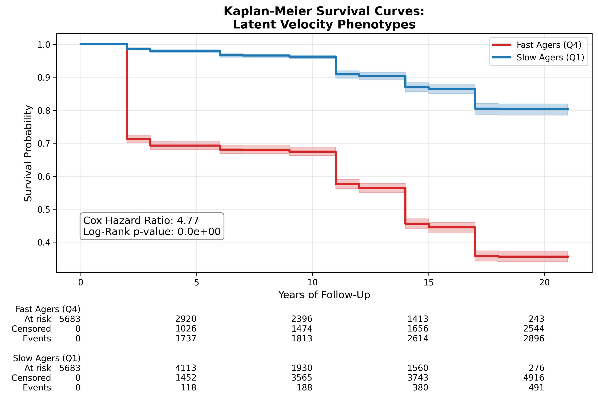
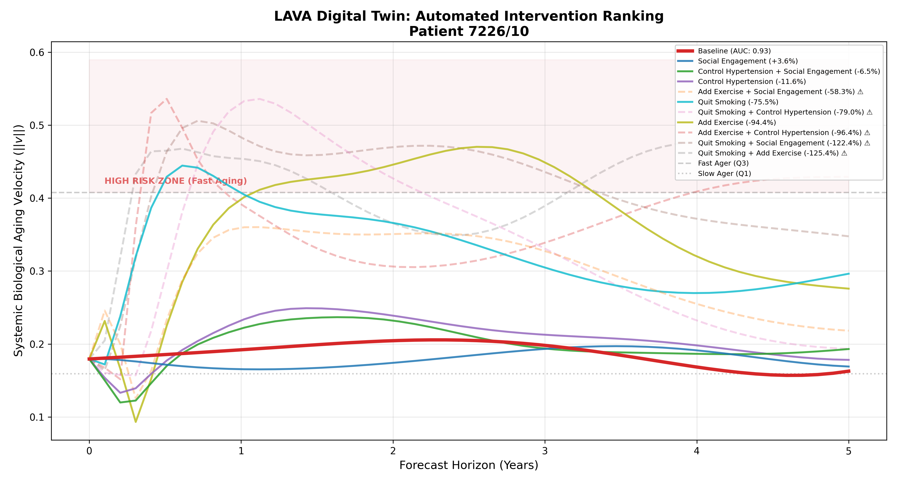
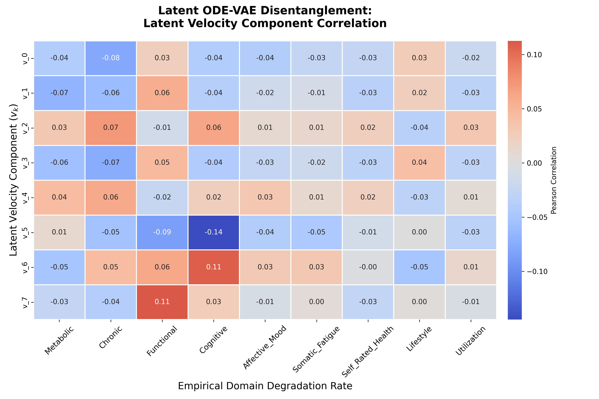

# CADENCE: Continuous Aging Dynamics Encoder via Neural ODEs
## Mapping Multi-Domain Biological Decline

CADENCE is a diagnostic framework for measuring the instantaneous velocity of biological aging. It projects multi-domain clinical deficits into a continuous 8-dimensional latent manifold, extracts temporal derivatives natively through a Neural ODE, and simulates counterfactual patient trajectories to rank clinical interventions.

## Core Concept

Current clinical models track aging through discrete, irregular snapshots (like the Frailty Index). They can tell you how frail a patient is *today*, but struggle to measure *how fast* that patient is declining.

CADENCE is built on the premise that aging is not a state — it is a velocity. To predict mortality and biological collapse, we must calculate the mathematical derivative of a patient's health over time.

CADENCE achieves this through a single model — the **Latent ODE-VAE**:

1. **Sequence Encoding** — A backward GRU (RecognitionRNN) reads the patient's full observation history `{(x_t, t)}` across irregular MHAS survey waves, producing a posterior distribution `q(z₀ | x)` over their initial latent state.

2. **Continuous Dynamics** — A Neural ODE integrates the latent state forward in time: `dz/dt = f_θ(z, u)`, where `u` is a 7D lifestyle control vector. This replaces the separate GP interpolation step — velocity is the model's native output.

3. **Reconstruction** — A decoder maps `z(t)` back to the 34-dimensional clinical deficit space at each observed wave, supervised by a weighted ELBO loss.

4. **Survival Supervision** — A dedicated RiskHead MLP learns to predict mortality risk from `μ`, trained with a Cox partial-likelihood loss. This keeps the latent geometry organized around clinical state rather than mortality norm, which is critical for faithful counterfactual simulation.

5. **Digital Twin** — Given a patient's encoded `z₀` and any counterfactual control `u'(t)`, the same ODE simulates an alternate biological trajectory. Interventions are ranked by 5-year AUC velocity reduction.

## Visual Highlights

### 1. Mortality Prediction (Survival Curves)
CADENCE's latent velocity phenotypes (Fast/Slow Ager, derived from the signed frailty-velocity projection) strongly predict mortality. The Kaplan-Meier curves show clear separation.



### 2. Intervention Ranking
The Digital Twin simulates counterfactual scenarios and ranks lifestyle changes by their 5-year velocity-magnitude reduction.



### 3. Latent Velocity Domain Disentanglement
Correlation heatmap between Latent ODE-VAE velocity components and empirical domain degradation rates across 9 clinical domains.



---

## Performance & Biological Validation

| Metric | Value |
|---|---|
| Cox Hazard Ratio (Fast vs Slow Ager) | **4.77** (p < 0.001) |
| MC Uncertainty HR (mean_unc_z) | **1.93** (p < 0.001) |
| Latent dims (no posterior collapse) | **8 / 8** |
| Inference speed per patient | **< 2ms** |

The **4.77× mortality hazard ratio** between Fast and Slow Ager phenotypes validates that the CADENCE latent velocity meaningfully captures biological aging rate.

---

## Pipeline Overview

*For mathematical detail, see the [Engine README](latent_velocity/engine/README.md) and the [Digital Twin README](latent_velocity/ode-digitaltwin/README.md).*

### 1. Data Preparation (`engine/prepare_frailty_data.py`)
Reads raw MHAS `.sav` survey files and encodes 36 clinical deficits across 5 domains (comorbidities, ADLs, mental health, cognition, biometrics) with MICE imputation. Outputs `data/frailty_index_data.csv`.

### 2. Latent ODE-VAE (`engine/train_latent_ode.py`)
Trains the joint model:
- **RecognitionRNN**: backward masked GRU encoding irregular observation sequences → `z₀` posterior
- **LatentODEFunc**: `dz/dt = f_θ(z, u)` — MLP with SiLU activations
- **Decoder**: `z(t)` → 34D deficit reconstruction (inverse-variance feature weighting)
- **RiskHead**: `μ → scalar risk` for Cox partial-likelihood supervision
- **β-annealing**: KL weight ramps from 0 → β over epochs 20–80 with per-dim free bits

### 3. Velocity Extraction (`engine/extract_latent_ode_velocity.py`)
Encodes each patient's full sequence → `z₀` distribution, then integrates the ODE on a dense time grid using 30 MC samples to propagate posterior uncertainty. Outputs `latent_velocity_trajectory_128.csv` — the velocity dataset consumed by `clinical_validation.py` and `benchmark.py`.

### 4. Digital Twin Simulation (`ode-digitaltwin/digital_twin.py`)
Auto-detects and loads the Latent ODE-VAE. Uses full-sequence encoding for `z₀`, then simulates counterfactual control trajectories with biological washout. Ghost Twin Guardrail (Mahalanobis distance) flags OOD predictions.

### 5. Clinical Validation (`engine/clinical_validation.py`)
Cox PH survival analysis, LMM, Kaplan-Meier curves, and latent velocity domain heatmap.

### 6. Inference Dashboard (`app_ui/`)
React 19 + Vite frontend calling FastAPI (`engine/server.py`) for per-patient inference, LLM-generated action plans, and intervention trajectory visualization.

---

## Project Structure

```
latent_velocity/
│
├── engine/
│   ├── prepare_frailty_data.py        # MHAS preprocessing → frailty_index_data.csv
│   ├── train_latent_ode.py            # Latent ODE-VAE (main model)
│   ├── extract_latent_ode_velocity.py # MC velocity extraction
│   ├── clinical_validation.py         # Cox PH, LMM, KM curves, heatmap
│   ├── benchmark.py                   # B1–B4 vs CADENCE C-index benchmark
│   └── server.py                      # FastAPI backend
│
├── ode-digitaltwin/
│   └── digital_twin.py                # Counterfactual simulation & intervention ranking
│
├── paper/
│   ├── paper.qmd                      # Quarto manuscript
│   ├── references.bib                 # Bibliography
│   ├── benchmark_results.csv          # Benchmark C-index table
│   └── figures/                       # Generated figure outputs
│
├── app_ui/                            # React 19 + Vite dashboard
├── plots/                             # Visualization outputs
│   ├── tSNE/
│   ├── intervention_ranking/
│   ├── digital_twin/
│   ├── latent_space/
│   ├── streamplots/
│   └── heatmaps/
├── models/                            # Frozen weights & trajectory CSVs
└── data/                              # Curated MHAS datasets
```

---

## Usage

**1. Preprocess data:**
```bash
python latent_velocity/engine/prepare_frailty_data.py
```

**2. Train the Latent ODE-VAE:**
```bash
python latent_velocity/engine/train_latent_ode.py
# Options: --epochs 150 --lambda_cox 0.15 --target_beta 0.1
```

**3. Extract velocity trajectories:**
```bash
python latent_velocity/engine/extract_latent_ode_velocity.py
# Options: --n_mc 30 --t_step 0.5
```

**4. Run clinical validation:**
```bash
python latent_velocity/engine/clinical_validation.py
```

**5. Launch the inference dashboard:**
```bash
# Backend
cd latent_velocity && python engine/server.py

# Frontend (new terminal)
cd latent_velocity/app_ui && npm install && npm run dev
```

## Installation

```bash
git clone https://github.com/EmilioVenegas/cadence.git
cd cadence
pip install -r requirements.txt
# Core: torch, torchdiffeq, lifelines, statsmodels, scikit-learn, fastapi
```
